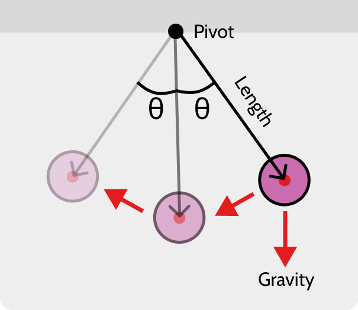
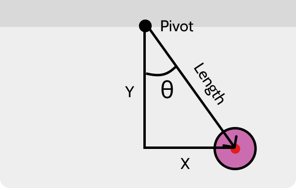
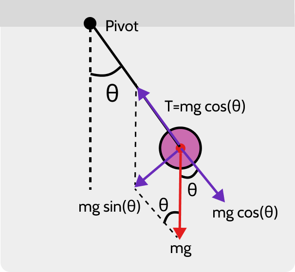

## 1. 단진자란?

**단진자(Simple Pendulum)** 란 간단히 말해서,줄 끝에 추를 매달고 반대편을 축 또는 점에 고정한 구조이다.
이러한 구조에 처음 힘을 가하게 되면 앞, 뒤로 왔다 갔다 하는 **진동 운동(Oscillatory Motion)** 양상을 보이게 된다.

다만, **"단(Simple)"** 이라는 단어가 암시하듯, 가장 간단한(이상적인) 진자의 구조를 이루고 있다.
다음과 같은 몇 가지 가정에 의해서 말이다.

- 줄의 질량은 무시할 수 있을 정도로 작다.
- 추는 부피가 없는 하나의 질점으로 취급한다.
- 저항이나 마찰력은 존재하지 않는다.
- 운동은 2차원에서만 일어난다.
- 균일한 중력장 속에서의 운동이다.
- 축은 움직이지 않는다.

## 2. 프로그래밍, 어떻게 접근해야 할까?

우리가 만들고자 하는 것은 **Canvas API**를 이용하여 진자의 움직임을 그래픽으로 표현하는 것이다.
이러한 결과물을 얻기 위해 우리는 어떤 **데이터**를 구해야하는 것일까?

위 그림은 단진자가 운동하는 모습을 간략히 나타낸 것이다.
그림을 보면 알 수 있듯이, **줄의 길이(Length)** , **각(θ)** , **중력의 작용(Gravity)** 등 기초적인 정보를 표시하고 있다.

픽셀이 기본 단위가 되는 2차원 좌표평면, Canvas안에서 우리가 구하고자 하는 것은 결국 추의 중심점의 위치이다.
시간이 지남에 따라 추의 중심점이 좌표평면 어디에 위치하고 있는지가 우리가 알고자 하는 것이다. **즉, 추의 중심점에 대한 벡터값이다.**

그렇다면 어떻게 구할 수 있을까? 가만히 보니 **축(Pivot)** 으로부터 추의 중심점을 이으면 삼각형의 빗변을 형성하는 것을 알 수 있다.

이제 삼각법의 사인함수와 코사인함수를 이용하여 x,y 좌표(추의 중심점)의 값을 구할 수 있다.

`sin(θ) = x / Length`이고 `cos(θ) = y / Length` 이기 때문에...

> **x = Length \* sin(θ)**  
> **y = Length \* cos(θ)**

다만 한 가지 간과한 것이 있다. 바로 추의 중심점에 대한 벡터는 **축(Pivot)** 을 원점으로 삼아 출발하였기에 이 점을 고려해야 한다.

> **x = Length \* sin(θ) + 축(Pivot)의 x좌표**  
> **y = Length \* cos(θ) + 축(Pivot)의 y좌표**

자연계에 시간이 존재하듯, 애니메이션의 세계에도 시간이라는 개념이 존재한다. 바로 프레임으로서 말이다.
위 식을 살펴보면, 프레임(시간)이 흘러감에 따라 변하는 변수가 있음을 알 수 있다.
**바로 θ, 각(Angle)이다.** (줄의 길이와 축의 좌표는 고정된 상수다.)

특정 프레임 시점마다의 각의 크기를 구하는 것이 결국 우리가 해야할 핵심 작업이다.

## 3. 진자를 움직이는 힘, 중력

위 그림은 오른쪽으로 대략 45도(θ) 당기고 놓았을 때, 그 시점에서의 힘의 작용을 표현한 것이다.

초기에 진자에 작용하는 힘은 중력 만이 존재한다.
이 중력이 진자를 움직이게 하는 원동력이다.
위 그림에서 중력은 `mg` 로 표현되어 있다.
`m`은 추의 질량을 나타내며, `g`는 중력가속도를 의미한다.

빗면에 놓인 물체에 작용하는 중력을 두 가지 벡터로 분해 할 수 있듯이,
위 그림의 상황에서도 **중력을 두 가지 성분(Component)으로 분해**할 수 있다.
`한 성분(mg cosθ)`은 추를 잡고있는 줄의 방향과 수평으로,
`다른 성분(mg sinθ)`수직으로 작용하는 힘이다.
즉, 중력이라는 벡터를 두 가지 힘으로 분해 한 것이다.
두 힘의 벡터 합은 중력의 총 벡터 값과 같다.

앞서 말한 성분 중 전자를 **수평 성분**, 후자를 **수직 성분**이라 칭하겠다.

먼저 **수평 성분** 쪽을 살펴보자. 이 힘은 줄과 수평으로 작용하여 추를 오른쪽 아래 방향으로 미는 역할을 한다. 그러나 줄이 추를 잡고 있기 때문에
반대 방향으로 같은 크기의 힘이 발생하는 데, 이것이 **중력에 의해서 발생하는 장력(Tension)** 이다. 장력과 수평 성분은 초기에 같은 크기(mg cosθ)
를 가지고 있기 때문에 **힘이 상쇄**되어 아무런 결과를 발생시키지 않는다. (_허나 줄의 전체 장력은 진자가 속도를 얻는 순간부터_
_구심력이 생겨 증가하게 된다_)

이번엔 **수직 성분**이다. 우리가 관심을 가져야 할 힘이 바로 이것이다. (진자를 움직이게 만드는 진정한 힘이라 할 수 있다) **뉴턴의 제 2 법칙(F = ma)** 을 통해
이 수직 성분의 힘을 표현해 보면 다음과 같다.

> **F = m \* gsin(θ)**

다시 전으로 돌아가서, 우리가 밝혀내야 하는 것은 특정 시점마다의 각의 크기라는 것을 상기해보자. 
초기 각의 크기가 45도라 하더라도 중력의 작용으로 각의 크기는 계속하여 변화한다.
**무언가 변한다는 것은 그 자체로 속도가 존재한다는 것을 의미한다.** 속도가 존재하지 않으면 어떤 물체든 정지 상태에 머물러 있을 것이다.

우리는 각에 대해 논의를 하고 있기 때문에 이 속도를 **각속도(Angular Velocity)** 라고 칭할 수 있다.
그렇다면 한 단계 더 파고들어서 각속도를 미분하면 **각가속도(Angular Acceleration)** 를 구할 수 있다.
이것이 의미하는 바는 반대로, 각가속도를 구하면 각속도를 구할 수 있고 각속도를 구하면 다음 시점의 각의 크기를 구할 수 있다는 것이다. (적분)
우리가 물체가 이동하는 속도 혹은 속력을 알고 있다면 몇 초 뒤 그 물체가 어디에 위치하고 있을 지 예측할 수 있는 것과 같은 논리이다. 

우리는 무엇이 진자를 움직이게 하는지, 즉 무엇이 각의 크기를 변하게 하는지 이미 알고 있다. **중력의 수직 성분**이다.
중력의 수직 성분의 힘의 크기가 `F = m * gsin(θ)`라는 것 또한 알고 있다.
힘의 공식(F = ma)은 가속도와 힘의 관계를 내포하고 있기 때문에 우리는 이 식에서 가속도를 추출해 낼 수 있다 (F / m = a).
그리고 그 추출해낸 그 가속도가 바로 각의 크기를 계산하기 위한 각가속도이다.

> **중력 수직 성분의 힘(F) = m \* gsin(θ)**  
> **각가속도(F / m) = g \* sin(θ)**

## 4. 코딩 전 마무리 정리

다음 글에서 자바스크립트 **Canvas API**를 이용해 진자가 진동하는 움직임을 그려 볼 것이다.
그 전에 논의했던 사항들을 정리하는 시간을 가져보자.

<Callout>
(1) 우리의 목표는 프레임마다 추의 중심점이 위치하는 x좌표와 y좌표를 찾는 것이다.

(2) 그 위치를 찾기 위한 공식을 구한다.

- x = Length \* sin(θ) + 축(Pivot)의 x좌표
- y = Length \* cos(θ) + 축(Pivot)의 y좌표

(3) 변수인 각의 크기를 얻기 위해 각가속도를 계산해야 한다.

(4) 중력 수직 성분의 힘이 진자에 가하는 알짜힘(Net Force)이 됨으로 그 힘을 통해 각가속도를 구할 수 있다.

- 중력 수직 성분의 힘(F) = m \* gsin(θ)
- 각가속도(F / m) = g \* sin(θ)
</Callout>

<Callout kind="info">
  재밌는 사실을 하나 발견할 수 있습니다.  
  위 공식에서 알 수 있다시피 추의 질량은 각이 변하는 속도에 어떠한 영향도 주지 않습니다.
  즉, 무거운 추이든 가벼운 추이든 추가 운동하는 속도에는 변함이 없는 것 입니다.
  그러므로 단진자의 **\*주기** 역시 추의 질량에 의존하지 않음을 알 수 있습니다. 😏

  **\*주기**: 진자의 왕복 운동이 한번 이루어지는 데 걸리는 시간
</Callout>

